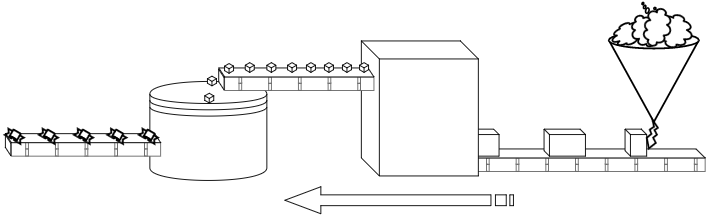
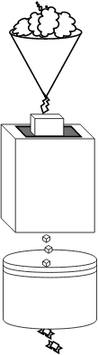
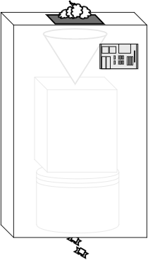

ถ้าคุณเป็นผู้มากประสบการณ์ในการเขียนโค้ด คงเคยประสบปัญหาอยู่อย่างหนึ่ง คือการอ่านโค้ดคนอื่นหรือแม้แต่ของตัวเองเพื่อทำความเข้าใจก่อนที่จะเริ่มเขียนเพิ่มหรือแก้ไขการทำงานของโค้ดนั้นๆ

มีนักวิจัยที่วิจัยเกี่ยวกับเรื่องนี้บอกไว้ว่า **“โปรแกรมเมอร์ใช้เวลา 70% ของเวลาทั้งหมดที่ใช้ในการเขียนโค้ดไปกับการอ่านโค้ดเพื่อทำเข้าใจมัน และค่าเฉลี่ยในการเขียนโค้ดของโปรแกรมเมอร์ทั่วโลกเพียง 5 บรรทัดต่อวันเท่านั้น”** — [Functional-Light JavaScript](https://github.com/getify/Functional-Light-JS "Functional-Light JavaScript") นั่นคือเราใช้เวลาเกือบทั้งวันในการอ่านโค้ดเพื่อให้ได้โค้ดเพียง 5 บรรทัด

ถ้าคุณเป็นโปรแกรมเมอร์ที่เขียนโค้ดที่มันเข้าใจยากหรือแก้ไขยากอาจจะโดนพูดถึงนิดๆ(หรือด่า) จากคนที่มาเขียนต่อจากคุณได้ ดังนั้นการจะเป็นโปรแกรมเมอร์ที่ดี คุณควรจะใส่ใจในการเขียนโค้ดแต่ละตัวอักษรที่เขียนขึ้นมาให้มันมีคุณสมบัติที่ อ่านง่าน (Readability) เข้าใจง่าย (Understandable) และแก้ไขง่าย (Maintainable)

ในบทความนี้เราจะมาพูดถึงเรื่องพื้นฐานหลักๆ ก่อนศึกษา Recompose ได้แก่ Function Composition และ Higher-order Component (HoC) เพื่อให้ง่ายต่อการเข้าใจเรื่อง Recompose และทุกๆ ตัวอย่างในบทความนี้ก็จะพยายามเปรียบเทียบให้เห็นว่าเขียนแบบไหนทำให้โค้ด **อ่านยาก เข้าใจยาก แก้ไขยาก** แล้วจะแก้ไขปัญหานี้ได้อย่างไร

- - -

## Function Composition คือ?

Function Composition คือการนำเอาฟังก์ชันสองฟังก์ชันหรือมากกว่า มาประกอบ (Compose) กันเพื่อให้ได้ฟังก์ชันใหม่ออกมา

ถ้านึกไม่ออกเดี๋ยวจะลองยกตัวอย่างโรงงานทำลูกอมไปพร้อมๆ กับยกตัวอย่างโดยใช้โค้ดในการอธิบายด้วย โดยที่โรงงานทำลูกอมมีกระบวนการการทำงานดังนี้

  - กระบวนการทำความเย็นช็อกโกแลตและอัดก้อนด้วย **เครื่องทำความเย็น : ช็อกโกแลตเหลว → ช็อกโกแลตที่ผ่านการทำความเย็นและอัดก้อน**
  - กระบวนการตัดช็อกโกแลตด้วย **เครื่องตัดช็อกโกแลต : ช็อกโกแลตที่ผ่านการทำความเย็นและอัดก้อน → ช็อกโกแลตก้อน**
  - กระบวนการห่อช็อกโกแลตด้วย **เครื่องห่อกระดาษ : ช็อกโกแลตก้อน → ช็อกโกแลตพร้อมจำหน่าย**


<center class="image">รูปจาก <a href="https://github.com/getify/Functional-Light-JS" title="Functional-Light JavaScript">Functional-Light JavaScript</a></center><br />

จะเห็นได้ว่าในแต่ละกระบวนการก็ต้องการ Input ที่เป็น Output ของกระบวนการก่อนหน้าเสมอ

ต่อไปลองมาดูตัวอย่างโค้ดบ้างนะครับ มีฟังก์ชันอยู่สองฟังก์ชันคือ `calculateMean` และ `toNumbers`

```js
const toNumbers = arr => {
  let result = [];
  for(let i=0; i < arr.length; i+=1) {
    result.push(Number(arr[i]));
  }
  return result;
};

const calculateMean = arr => {
  let result = 0;
  for(let i=0; i < arr.length; i+=1) {
    result += arr[i];
  }
  return result / arr.length;
};
```

สมมุติมี ​Requirement ว่าให้หาค่าเฉลี่ยจากอาเรย์ของตัวเลขรูปแบบข้อมูลดังนี้ `const numbers = [1, 2, 3, 4, 5];` ก็ไม่ยากใช่ไหมไหมครับเพียงแค่เรียกใช้ฟังก์ชัน `calculateMean`

```js
const numbers = [1, 2, 3, 4, 5];
const mean = calculateMean(numbers);
console.log(mean); // 3
```

แต่ถ้าอาเรย์ของตัวเลขรูปแบบข้อมูลแบบนี้ `const numbers = ['1', '2', '3', '4', 5'];` เราก็ต้องใช้ฟังก์ชัน `toNumbers` เพื่อทำให้ตัวเลขพวกนั้นใช้ได้กับฟังก์ชัน calculateMean

```js
const numbers = ['1', '2', '3', '4', 5'];
const convertedNumbers = toNumbers(numbers);
const mean = calculateMean(convertedNumbers);
console.log(mean); // 3
```

สิ่งที่เหมือนกันกับโรงงานทำลูกอมก็คือ Input ของฟังก์ชันเป็น Output ของอีกฟังก์ชัน เช่นกันกับแต่ละกระบวนการก็ต้องการ Input ที่เป็น Output ของกระบวนการก่อนหน้า และแต่ละ Output ที่ออกมาถูกลำเลียงผ่านสายพานเพื่อเป็น Input ให้อีกกระบวนการ เช่นกันกับ Output ของฟังก์ชันก็ถูกลำเลียงผ่านตัวแปร `convertedNumbers` แทนที่จะเป็นสายพาน

ต่อมาโรงงานทำลูกอมมีนโยบายอยากประหยัดค่าใช้จ่ายและลดพื้นที่ โดยนำเอาเครื่องแต่ละเครื่องมาวางเรียงต่อกันเป็นแนวตั้งโดยเอาเครื่องที่ต้องทำงานก่อนไว้ข้างบนสุดเพื่อ Output ออกมาจากเครื่องนั้นๆ เป็น Input ของอีกเครื่องเลยโดยไม่จำเป็นต้องลำเลียงผ่านสายพาน


<center class="image">รูปจาก <a href="https://github.com/getify/Functional-Light-JS" title="Functional-Light JavaScript">Functional-Light JavaScript</a></center><br />

ถ้าเอามาเปรียบโค้ดกับโรงงานทำลูกอมตอนนี้แล้วโค้ดของก็จะมีหน้าตาแบบนี้ครับ

```js
const mean = calculateMean(toNumbers(numbers));
```

ตัวแปร `convertedNumbers` ก็ไม่จำเป็นอีกต่อไป เพียงใช้ Output จาก `toNumbers(numbers)` ไปเป็น Argument ของฟังชัน `calculateMean` เลย

วันหนึ่งโรงงานนี้ได้สร้างกล่องใส่เครื่องที่ใช้ทำลูกอมทั้งสามจุดประสงค์เพื่อให้ดูสะอาดตาและดูแลง่าย กล่องนี้มีหน้าที่เพียงรับช็อกโกแลตเหลวจากด้านบนของกล่องและส่งช็อกโกแลตที่พร้อมจำหน่ายด้านล่างของกล่อง


<center class="image">รูปจาก <a href="https://github.com/getify/Functional-Light-JS" title="Functional-Light JavaScript">Functional-Light JavaScript</a></center><br />

กลับมาที่โค้ดเพื่อให้ได้โค้ดหาค่าเฉลี่ยเพื่อใช้ในหลายๆ ที่ของแอปฯ ก็ควรจะห่อมันด้วยฟังก์ชัน แบบนี้

```js
function calculateMeanByNumbers(arr) {
  return calculateMean(toNumbers(arr));
}
// ...
const mean = calculateMeanByNumbers(numbers);
console.log(mean); // 3
```

ดูที่ฟังก์ชัน `calculateMeanByNumbers` ทำการประกอบ (Compose) ฟังก์ชัน `toNumbers` และ `calculateMean` เข้าด้วยกัน มีการทำงานจากขวาไปช้ายดังนี้

```mean <-- calculateMean <-- toNumbers <-- numbers```

มาถึงจุดนี้คุณคงจะเข้าใจ Compose ไม่มากก็น้อยแล้วนะครับ จากฟังก์ชัน `calculateMeanByNumbers` จะทำให้มันอ่านง่ายกว่าเดิมโดยใช้ฟังก์ชัน `compose`

```js
function compose(f, g) {
  return function(x) {
    return f(g(x));
  }
}
// ES6 ...
const compose = (f, g) => x => f(g(x));
const calculateMeanByNumbers = compose(calculateMean, toNumbers);
const mean = calculateMeanByNumbers(numbers);
console.log(mean); // 3
```

จากโค้ด `const calculateMeanByNumbers = compose(calculateMean, toNumbers)` มันจะแปลงเป็นฟังก์ชันได้แบบนี้ครับ

```js
const calculateMeanByNumbers = x => calculateMean(toNumbers(x));
```

ต่อไปจะทำการปรับฟังก์ชัน `compose` ใหม่ในกรณีที่ต้องการ Compose กันมากกว่า 2 ฟังก์ชัน ถ้าใช้ฟังก์ชัน `compose` อันเก่าแล้วต้องการ Compose กัน 3 ฟังก์ชันจะทำได้แบบนี้ครับ

```js
const something = (x) => {...}
const calculateMeanByNumbers = 
  compose(compose(calculateMean, toNumbers), something);
```

ส่วนการทำงานเหมือนเดิมครับ คือจะไล่จากขวาไปซ้าย ส่วนฟังก์ชัน `compose` ที่จะปรับเป็นแบบนี้ครับ

```js
const compose = (...fns) => x => fns.reduceRight((v, f) => f(v), x);
```

`compose` ตอนนี้เป็นฟังก์ชันที่รับอาเรย์ของฟังก์ชันมาวนลูปเพื่อ Call แต่ละฟังก์ชันในอาเรย์นั้นครับ ที่ใช้ `reduceRight` เพราะต้องการให้ Call จากขวาไปซ้าย เช่น `compose(fn3, fn2, fn1)('value')` รอบการทำงานจะเป็นแบบนี้ครับ

```
[fn3, fn2, fn1].reduceRight((v, f) => f(v), 'value');
//...
0. v = 'value', f = fn1(v)
1. v = fn1('value'), f = fn2(v)
2. v = fn2(fn1('value')), f = fn3(v)
3. v = fn3(fn2(fn1('value'))), f = null
```

วิธีการใช้ก็เอาฟังก์ชันที่ต้องการมาใส่เป็น Argument กี่ฟังก์ชันก็ได้แบบนี้

```js
const calculateMeanByNumbers = 
  compose(calculateMean, toNumbers, something2, something1);
```

ตอนนี้โค้ดที่เขียนขึ้นมาจะอ่านง่ายมากขึ้น เพื่อเป็นการทำให้เข้าใจและเห็นประโยชน์ของเรื่อง Compose ให้มากขึ้นอีก ผมจะยกตัวอย่างโค้ดชุดหนึ่งขึ้นมานะครับ ซึ่งโค้ดนี้มีหน้าที่คือ

1. แยกคำจากค่าที่ส่งเข้ามาด้วยเว้นวรรค ให้เป็นอาเรย์ของคำ
1. ลบอักษรพิเศษออกจากคำ
1. ทำให้เป็น Lower Case
1. ต่อคำแต่ละคำด้วยขีด (-)

```js
const removeSpecialChar = word => word.replace(/[^a-zA-Z0-9]/g, '');

const toSlug = input => input.split(/\s/)
  .map(removeSpecialChar)
  .map(word => word.toLowerCase())
  .join('-');
```

ซึ่งเป็นโค้ดในการทำ Slug นั้นเองครับ เช่น ใส่ค่า `What is Function Composition?` ผลลัพธ์ที่ได้ควรจะได้ `what-is-function-composition` ต่อไปผมจะทำให้ฟังก์ชัน `toSlug` อันนี้ให้อ่านง่ายกว่าเดิมโดยใช้ `compose`

```js
const removeSpecialChar = word => word.replace(/[^a-zA-Z0-9]/g, '');
const split = splitOn => str => str.split(splitOn);
const toLowerCase = word => word.toLowerCase();
const join = str => arr => arr.join(str);
const map = fn => arr => arr.map(fn);
const compose = (...fns) => x => fns.reduceRight((v, f) => f(v), x);

// without compose
const toSlug = input => join('-')(
  map(toLowerCase)(
    map(removeSpecialChar)(
      split(/\s/)(
        input
      )
    )
  )
);

// or
// with compose
const toSlug = compose(
  join('-'),
  map(toLowerCase),
  map(removeSpecialChar),
  split(/\s/),
);
```

เมื่อใช้ `compose` โค้ดก็จะอ่านและแก้ไขได้ง่ายมากครับ เช่น หากไม่อยากลบตัวอักษรพิเศษแล้วก็เพียงแค่ลบ `map(removeSpecialChar)` ออก ส่วนการทำงานของฟังก์ชัน `toSlug` ก็จะไล่จากขวาไปช้าย สมมุติมีการส่งค่า `x` มาในฟังก์ชันมันก็จะทำงานตามนี้

```
slug <-- join('-') <-- map(toLowerCase) <-- map(removeSpecialChar) <-- split(/\s/) <-- x
```

พวกฟังก์ชัน split map join compose เราไม่จำเป็นต้องเขียนเองนะครับสามารถใช้จากไลบรารี่ต่างๆ ได้เลย เช่น [Ramda](http://ramdajs.com/docs/) หรือ [lodash/fp](https://github.com/lodash/lodash/wiki/FP-Guide)

---

## HoC คือ?

มันคือฟังก์ชันธรรมดาๆ ที่รับ Component เป็น Parameter และรีเทิร์น Component ใหม่ที่มีความสามารถเพิ่มขึ้นออกไป

```
HoC :: Component -> Component
```

ลองจินตนาการแอปฯ ของเรามีหลายๆ Component แล้วบาง Component ต้องทำหน้าที่อะไรบางอย่างเหมือนกัน วิธีแก้ปัญหา คือแยกการทำงานนั้นออกให้เป็นฟังก์ชันและ `export` มันออกไปเพื่อให้ Component อื่น `import` มาใช้งานได้ง่ายๆ เมื่อการทำงานนั้นมี Change ก็แก้เพียงที่เดียว HoC ก็คล้ายๆกันครับ มันไม่ใช่ฟีเจอร์หรืออะไรใหม่ของ React เลย มันมีมาเพื่อใช้แก้ปัญหานี้นั้นเอง

ลองดูที่ Component นี้นะครับ

```jsx
class NoHoC extends React.Component {
  constructor(props) {
    super(props);
    this.state = {
      count: 0,
      text: '',
    };
    this.incrementCount = this.incrementCount.bind(this);
    this.onTextChange = this.onTextChange.bind(this);
  }
  incrementCount() {
    this.setState(
      { count: this.state.count + 1 }
    );
  };
  onTextChange({ target }) {
    this.setState(
      { text: target.value }
    );
  }
  render() {
    return (
      <div>
        <h1>
          Clicks: { this.state.count }
        </h1>
        <button onClick={this.incrementCount}>+</button>
        <hr />
        <div>
          <textarea
            value={this.state.text}
            onChange={this.onTextChange}
          />
          <p>{this.state.text}</p>
        </div>
      </div>
    );
  }
}
```

ที่อยากจะให้สังเกตคือ State ใน Component มีอยู่สองค่าคือ `count` กับ `text` ปัญหาก็คือทุกๆ State ที่ถูกกำหนด ต้องมีการสร้างฟังก์ชันเพื่อที่จะต้องมาอัปเดตเสมอ ในที่นี้ก็จะมี `incrementCount` และ `onTextChange` และสองฟังก์ชันนี้ยังต้อง `.bind(this)` อีก ต่อไปผมจะยกตัวอย่างการสร้าง HoC เพื่อมาใช้แก้ปัญหานี้โดยมีคอนเซ็ปต์คือมันจะต้องเป็นฟังก์ชันที่รับ ชื่อของ State ชื่อที่ไว้ใช้อัปเดต State และค่าเริ่มต้นของ State และรีเทิร์น HoC ออกไป

```
withState :: (stateName, stateUpdateName, initialValue) 
  -> BaseComponent -> NewComponent
```

```jsx
import React from 'react';

const withState = (stateName, stateUpdateName, initialValue) => BaseComponent =>
  class extends React.Component {
    constructor(props) {
      super(props);
      this.state = {
        value: initialValue,
      };
    }
    updateValue(fn) {
      this.setState(({ value }) => ({
        value: fn(value),
      }));
    }
    render() {
      const newProps = {
        [stateName]: this.state.value,
        [stateUpdateName]: this.updateValue.bind(this),
      };
      return (
        <BaseComponent
          {...this.props}
          {...newProps}
        />
      );
    }
  }

export default withState;
```

เมื่อเรามี `withState` เวลาเราเขียน Component ก็ Import `withState` เข้ามาพร้อมกับเรียกใช้แบบนี้ `withState('count', 'updateCount', 0)(BaseComponent)` แล้ว `BaseComponent` ก็จะมี `props` คือ `count` และ `updateCount` สำหรับใช้อัปเดต

```jsx{numberLines: true}
import React from 'react';
import withState from './withState';

const FooComponent = (props) => (
  <div>
    <h1>
      Clicks: { props.count }
    </h1>
    <button onClick={() => props.updateCount((count) => count + 1)}>+</button>
    <hr />
    <div>
      <textarea
        value={props.text}
        onChange={({ target }) => props.updateText(() => target.value)}
      />
      <p>{props.text}</p>
    </div>
  </div>
);

export default withState('count', 'updateCount', 0)(
  withState('text', 'updateText', '')(
    FooComponent
  )
);
```

จะเห็นได้ว่า Component ดูสะอาดตา อ่านง่ายๆ ไม่มี `class` ไม่มี `this` ไม่มี `.bind(this)` แต่…. ยังไม่พอครับ ที่บรรทัด 21 มีการเรียกฟังก์ชัน `withState` ซ้อนกันอยู่ เดี๋ยวเราจะนำ Compose ที่พูดถึงกันมาก่อนหน้านี้ทำให้การใช้ HoC อ่านง่ายขึ้น

Compose ที่ใช้กับฟังก์ชัน คือการนำเอาฟังก์ชันสองฟังก์ชันหรือมากกว่า มาประกอบ (Compose) กันเพื่อให้ได้ฟังก์ชันใหม่ออกมา

ดังนั้น Compose ที่ใช้กับ HoC คือการนำเอา HoC สอง HoC หรือมากกว่า มาประกอบ (Compose) กันเพื่อให้ได้ HoC ใหม่ออกมานั่นเอง

```jsx

import React from 'react';
import withState from './withState';

const FooComponent = (props) => (
  <div>
    <h1>
      Clicks: { props.count }
    </h1>
    <button onClick={() => props.updateCount((count) => count + 1)}>+</button>
    <hr />
    <div>
      <textarea
        value={props.text}
        onChange={({ target }) => props.updateText(() => target.value)}
      />
      <p>{props.text}</p>
    </div>
  </div>
);

const compose = (...fns) => x => fns.reduceRight((v, f) => f(v), x);

const enhance = compose(
  withState('count', 'updateCount', 0),
  withState('text', 'updateText', '')
);

export default enhance(FooComponent);
```

ต่อไปจะยกตัวอย่างสร้าง HoC อีกสักหนึ่งตัวนะครับ เพื่อใช้สำหรับแก้ไข Props โดยผมอยากทำให้ FooComponent เพิ่ม Prop สำหรับลบเพิ่มค่า Count และเพิ่ม Prop `onTextChange` สำหรับอัปเดต `text`

```
mapProps :: mapFn -> BaseComponent -> NewComponent
```

```jsx
import React from 'react';

const mapProps = mapFn => BaseComponent =>
  (props) => (
    <BaseComponent
      {...mapFn(props)}
    />
  );

export default mapProps;
```

และ `FooComponent` เขียนใหม่ได้แบบนี้ครับ

```jsx

import React from 'react';
import withState from './withState';
import mapProps from './mapProps';

const FooComponent = (props) => (
  <div>
    <h1>
      Clicks: { props.count }
    </h1>
    <button onClick={props.incrementCount}>+</button>
    <button onClick={props.decrementCount}>-</button>
    <hr />
    <div>
      <textarea
        value={props.text}
        onChange={props.onTextChange}
      />
      <p>{props.text}</p>
    </div>
  </div>
);

const compose = (...fns) => x => fns.reduceRight((v, f) => f(v), x);

const enhance = compose(
  withState('count', 'updateCount', 0),
  withState('text', 'updateText', ''),
  mapProps(props => ({
    ...props,
    incrementCount: () => props.updateCount(count => count + 1),
    decrementCount: () => props.updateCount(count => count - 1),
    onTextChange: ({ target }) => props.updateText(() => target.value),
  }))
);

export default enhance(FooComponent);
```

มาถึงจุดนี้ก็คงพอจะเข้าใจการทำ HoC ไม่มากก็น้อยนะครับ ผมคิดว่ามันค่อนข้างมีประโยชน์มากๆ นอกจากอ่านโค้ดง่าย ยังช่วยให้ไม่ต้องเอา UI ผูกติดกับ Logic

---

## Recompose คือ?

> 2022 Updated! ใช้ [React Hooks](https://reactjs.org/docs/hooks-intro.html) เหอะ

มันคือไลบรารี่ที่รวบรวม HoC ที่ช่วยให้เราแยก UI กับ Logic ได้เป็นอย่างดีนั่นเอง ดังนั้นไม่ว่าจะเป็น `withState` หรือ `mapProps` สามารถ Import เข้ามาจาก Recompose ได้เลย

ตัวอย่าง `FooComponent` ที่ใช้ Recompose

```jsx
import React from 'react';
import { compose, withState, mapProps } from 'recompose';

const FooComponent = (props) => (
  <div>
    <h1>
      Clicks: { props.count }
    </h1>
    <button onClick={props.incrementCount}>+</button>
    <button onClick={props.decrementCount}>-</button>
    <hr />
    <div>
      <textarea
        value={props.text}
        onChange={props.onTextChange}
      />
      <p>{props.text}</p>
    </div>
  </div>
);

const enhance = compose(
  withState('count', 'updateCount', 0),
  withState('text', 'updateText', ''),
  mapProps(props => ({
    ...props,
    incrementCount: () => props.updateCount(count => count + 1),
    decrementCount: () => props.updateCount(count => count - 1),
    onTextChange: ({ target }) => props.updateText(() => target.value),
  }))
);

export default enhance(FooComponent);
```

ข้อเสียของ Recompose ที่ผมเห็น คือตอน Debug ด้วย React Developer Tools มันจะถูก Stack หลายๆชั้นตาม HoC ที่เราใช้ ทำให้หา BaseComponent ยากหน่อยเวลาต้องการ Debug

HoC อื่นๆ ของ Recompose ตามไปอ่านได้[ที่นี่](https://github.com/acdlite/recompose)ได้เลยครับ มี HoC มากมายที่จะช่วยให้โค้ดของคุณ สวยงามขึ้นได้แน่นอน

---
